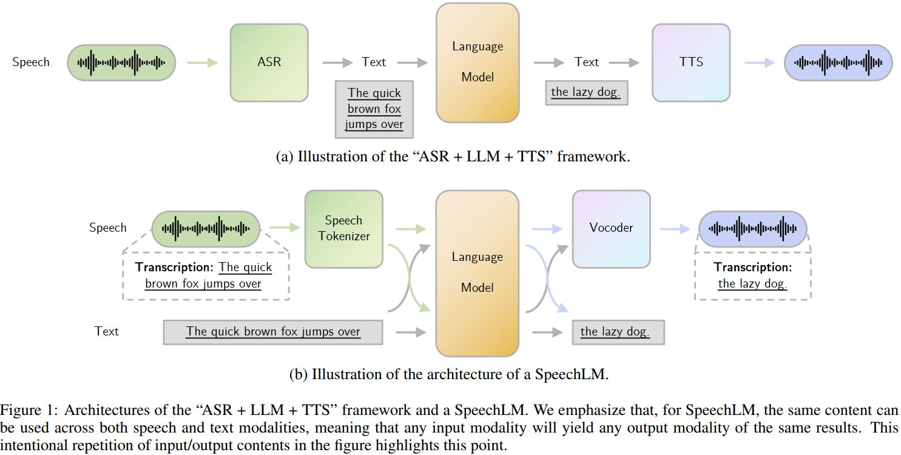
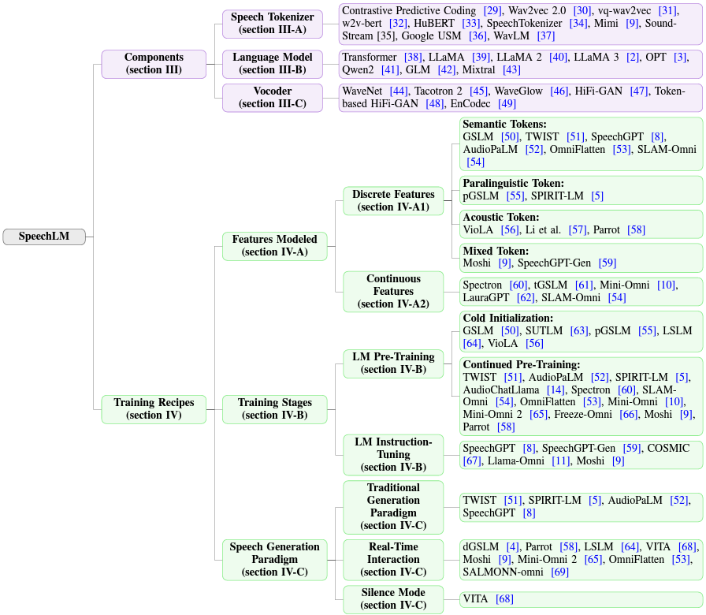

# Awesome-SpeechLM-Survey
<!-- [](https://huggingface.co/datasets/qqjz/VoxEval) -->
[](https://arxiv.org/abs/2410.03751)

**🎉🎉🎉Our survey paper "Recent Advances in Speech Language Models: A Survey" has been accepted to ACL 2025 main conference!**

This is the Github repository for paper: [*Recent Advances in Speech Language Models: A Survey*](https://arxiv.org/abs/2410.03751). In this paper, we survey the field of Speech Language Models (SpeechLMs), which are capable of performing end-to-end speech interactions with humans and serve as autoregressive foundation models.

# News
- We have released [*VoxEval: Benchmarking the Knowledge Understanding Capabilities of End-to-End Spoken Language Models*](https://arxiv.org/abs/2501.04962) on arXiv!🎉 Also check it out on [Github](https://github.com/dreamtheater123/VoxEval).

## Introduction
Why SpeechLMs? SpeechLMs are used for end-to-end speech-based interactions. Traditional ASR + LLM + TTS setups suffer from information loss and cumulative errors during conversion. SpeechLMs directly model speech data, capturing both semantic and paralinguistic information for richer interactions!



## Taxonomy
We introduce a novel taxonomy for SpeechLMs, categorizing them based on their architecture and training recipes.



## Existing SpeechLMs
| Model | Title | Url |
|-------|-------|-----|
|  OpenAI Advanced Voice Mode    | OpenAI Advanced Voice Mode | [Link](https://help.openai.com/en/articles/9617425-advanced-voice-mode-faq)  |
|  Claude Voice Mode     | Claude Voice Mode | [Link](https://support.anthropic.com/en/articles/11101966-using-voice-mode-on-claude-mobile-apps)  |
|  MindGPT-4o-Audio     | 理想同学MindGPT-4o-Audio实时语音对话大模型发布 | [Link](https://mp.weixin.qq.com/s?__biz=MzkyNzc3ODYzMQ==&mid=2247483808&idx=1&sn=15b2d0fc5c415066e9e85a0e17fa4094&chksm=c313b6c42e4bac7f551e3ce6b314897e6c09b2829d202ae09b088c39b6208d14545221a82785&mpshare=1&scene=1&srcid=06157RruwKQJDuZvxSmt0ALH&sharer_shareinfo=4f156f5dabba628552a2429a555bca65&sharer_shareinfo_first=4f156f5dabba628552a2429a555bca65#rd)  |
|  VITA-Audio     | VITA-Audio: Fast Interleaved Cross-Modal Token Generation for Efficient Large Speech-Language Model | [Link](https://arxiv.org/abs/2505.03739)  |
|  Voila     | Voila: Voice-Language Foundation Models for Real-Time Autonomous Interaction and Voice Role-Play | [Link](https://arxiv.org/abs/2505.02707)  |
|  Kimi-Audio     | Kimi-Audio Technical Report | [Link](https://arxiv.org/abs/2504.18425)  |
|  Lyra     | Lyra: An Efficient and Speech-Centric Framework for Omni-Cognition | [Link](https://arxiv.org/abs/2412.09501)  |
|  Flow-Omni     | Continuous Speech Tokens Makes LLMs Robust Multi-Modality Learners | [Link](https://arxiv.org/abs/2412.04917)  |
|  NTPP     | NTPP: Generative Speech Language Modeling for Dual-Channel Spoken Dialogue via Next-Token-Pair Prediction | [Link](https://arxiv.org/abs/2506.00975)  |
|  Qwen2.5-Omni     | Qwen2.5-Omni Technical Report | [Link](https://arxiv.org/abs/2503.20215)  |
|  CSM     | Conversational Speech Generation Model | [Link](https://www.sesame.com/research/crossing_the_uncanny_valley_of_voice)  |
|  Minmo     | MinMo: A Multimodal Large Language Model for Seamless Voice Interaction | [Link](https://arxiv.org/abs/2501.06282)  |
|  Slamming     | Slamming: Training a Speech Language Model on One GPU in a Day | [Link](https://arxiv.org/abs/2502.15814)  |
|  VITA-1.5     | VITA-1.5: Towards GPT-4o Level Real-Time Vision and Speech Interaction | [Link](https://arxiv.org/abs/2501.01957)  |
|  Baichuan-Audio     | Baichuan-Audio: A Unified Framework for End-to-End Speech Interaction | [Link](https://arxiv.org/abs/2502.17239)  |
|  Step-Audio     | Step-Audio: Unified Understanding and Generation in Intelligent Speech Interaction | [Link](https://arxiv.org/abs/2502.11946)  |
|  MiniCPM-o     | A GPT-4o Level MLLM for Vision, Speech and Multimodal Live Streaming on Your Phone | [Link](https://github.com/OpenBMB/MiniCPM-o)  |
|  SyncLLM     | Beyond Turn-Based Interfaces: Synchronous LLMs as Full-Duplex Dialogue Agents | [Link](https://arxiv.org/abs/2409.15594)  |
|  OmniFlatten     | OmniFlatten: An End-to-end GPT Model for Seamless Voice Conversation | [Link](https://arxiv.org/abs/2410.17799)  |
|  SLAM-Omni     | SLAM-Omni: Timbre-Controllable Voice Interaction System with Single-Stage Training | [Link](https://arxiv.org/abs/2412.15649)  |
|  GLM-4-Voice     | GLM-4-Voice: Towards Intelligent and Human-Like End-to-End Spoken Chatbot | [Link](https://arxiv.org/abs/2412.02612)  |
|  -     | Scaling Speech-Text Pre-training with Synthetic Interleaved Data | [Link](http://arxiv.org/abs/2411.17607)  |
|   SALMONN-omni    | SALMONN-omni: A Codec-free LLM for Full-duplex Speech Understanding and Generation  | [Link](http://arxiv.org/abs/2411.18138) |
|   Mini-Omni2    | Mini-Omni2: Towards Open-source GPT-4o with Vision, Speech and Duplex Capabilities  | [Link](http://arxiv.org/abs/2410.11190)      |
|   Uniaudio    | Uniaudio: An audio foundation model toward universal audio generation  | [Link](https://arxiv.org/abs/2310.00704) |
|   Parrot    | Parrot: Autoregressive Spoken Dialogue Language Modeling with Decoder-only Transformers | [Link](https://openreview.net/forum?id=Ttndg2Jl5F) |
|    Moshi   | Moshi: a speech-text foundation model for real-time dialogue  | [Link](https://kyutai.org/Moshi.pdf) |
|    Freeze-Omni   | Freeze-Omni: A Smart and Low Latency Speech-to-speech Dialogue Model with Frozen LLM   | [Link](http://arxiv.org/abs/2411.00774) |
|   EMOVA    | EMOVA: Empowering Language Models to See, Hear and Speak with Vivid Emotions    | [Link](http://arxiv.org/abs/2409.18042)   |
|   IntrinsicVoice    | IntrinsicVoice: Empowering LLMs with Intrinsic Real-time Voice Interaction Abilities  | [Link](http://arxiv.org/abs/2410.08035)  |
|    LSLM   | Language Model Can Listen While Speaking  | [Link](http://arxiv.org/abs/2408.02622)   |
|   SpiRit-LM    | SpiRit-LM: Interleaved Spoken and Written Language Model       | [Link](http://arxiv.org/abs/2402.05755)  |
|    SpeechGPT-Gen   | SpeechGPT-Gen: Scaling Chain-of-Information Speech Generation | [Link](https://arxiv.org/abs/2401.13527v2) |
|    Spectron   | Spoken Question Answering and Speech Continuation Using Spectrogram-Powered LLM   | [Link](https://openreview.net/forum?id=izrOLJov5y)   |
|  SUTLM   | Toward Joint Language Modeling for Speech Units and Text | [Link](http://arxiv.org/abs/2310.08715)   |
|   tGSLM    | Generative Spoken Language Model based on continuous word-sized audio tokens    | [Link](https://arxiv.org/abs/2310.05224v1)   |
|   LauraGPT    | LauraGPT: Listen, Attend, Understand, and Regenerate Audio with GPT   | [Link](https://arxiv.org/abs/2310.04673v4)  |
|    VoxtLM   | VoxtLM: Unified Decoder-Only Models for Consolidating Speech Recognition, Synthesis and Speech, Text Continuation Tasks | [Link](https://ieeexplore.ieee.org/abstract/document/10447112/?casa_token=rNHOTa7BbZMAAAAA:3Dk4RlgUcRbvDIewE9uUk-wk5D_0f2zm1z4hGgG1DSMkiH-KZwk7AVs5Z8PVMetvCKxFdV1C9o0) |
|   VITA    | VITA: Towards Open-Source Interactive Omni Multimodal LLM    | [Link](https://arxiv.org/abs/2408.05211)   |
|    FunAudioLLM   | FunAudioLLM: Voice Understanding and Generation Foundation Models for Natural Interaction Between Humans and LLMs       | [Link](https://arxiv.org/abs/2407.04051)  |
|    Voicebox   | Voicebox: Text-guided multilingual universal speech generation at scale | [Link](https://proceedings.neurips.cc/paper_files/paper/2023/hash/2d8911db9ecedf866015091b28946e15-Abstract-Conference.html)  |
|  LLaMA-Omni  | LLaMA-Omni: Seamless Speech Interaction with Large Language Models   | [Link](https://arxiv.org/abs/2409.06666) |
|   Mini-Omni    | Mini-Omni: Language Models Can Hear, Talk While Thinking in Streaming | [Link](https://arxiv.org/abs/2408.16725)        |
|   TWIST    | Textually pretrained speech language models | [Link](https://proceedings.neurips.cc/paper_files/paper/2023/hash/c859b99b5d717c9035e79d43dfd69435-Abstract-Conference.html) |
|   GPST    | Generative pre-trained speech language model with efficient hierarchical transformer  | [Link](https://aclanthology.org/2024.acl-long.97) |
|   AudioPaLM    | AudioPaLM: A Large Language Model That Can Speak and Listen  | [Link](http://arxiv.org/abs/2306.12925) |
|    VioLA   | VioLA: Unified Codec Language Models for Speech Recognition, Synthesis, and Translation | [Link](http://arxiv.org/abs/2305.16107)   |
|   SpeechGPT    | Speechgpt: Empowering large language models with intrinsic cross-modal conversational abilities | [Link](https://arxiv.org/abs/2305.11000) |
|   dGSLM    | Generative spoken dialogue language modeling | [Link](https://direct.mit.edu/tacl/article-abstract/doi/10.1162/tacl_a_00545/115240) |
|   pGSLM    | Text-Free Prosody-Aware Generative Spoken Language Modeling  | [Link](http://arxiv.org/abs/2109.03264) |
|   GSLM    | On generative spoken language modeling from raw audio | [Link](https://direct.mit.edu/tacl/article-abstract/doi/10.1162/tacl_a_00430/108611) |

## SpeechLM Tokenizers
### Semantic Tokenizers
| Name | Title | Url |
|-------|-------|-----|
|  Whisper     | Robust Speech Recognition via Large-Scale Weak Supervision | [Link](https://arxiv.org/abs/2212.04356)  |
|  CosyVoice     | CosyVoice: A Scalable Multilingual Zero-shot Text-to-speech Synthesizer based on Supervised Semantic Tokens | [Link](https://arxiv.org/abs/2407.05407)  |
|  Google USM     | Google USM: Scaling Automatic Speech Recognition Beyond 100 Languages | [Link](https://arxiv.org/abs/2303.01037)  |
|  WavLM     | WavLM: Large-Scale Self-Supervised Pre-Training for Full Stack Speech Processing | [Link](https://arxiv.org/abs/2110.13900)  |
|  HuBERT     | HuBERT: Self-Supervised Speech Representation Learning by Masked Prediction of Hidden Units | [Link](https://arxiv.org/abs/2106.07447)  |
|  W2v-bert     | W2v-BERT: Combining Contrastive Learning and Masked Language Modeling for Self-Supervised Speech Pre-Training | [Link](https://arxiv.org/abs/2108.06209)  |
|  Wav2vec 2.0     | wav2vec 2.0: A Framework for Self-Supervised Learning of Speech Representations | [Link](https://arxiv.org/abs/2006.11477)  |

### Acoustic Tokenizers
| Name | Title | Url |
|-------|-------|-----|
|  WavTokenizer     | WavTokenizer: an Efficient Acoustic Discrete Codec Tokenizer for Audio Language Modeling | [Link](https://arxiv.org/abs/2408.16532)  |
|  SNAC     | SNAC: Multi-Scale Neural Audio Codec | [Link](https://arxiv.org/abs/2410.14411)  |
|  Encodec     | High Fidelity Neural Audio Compression | [Link](https://arxiv.org/abs/2210.13438)  |
|  SoundStream     | SoundStream: An End-to-End Neural Audio Codec | [Link](https://arxiv.org/abs/2107.03312)  |

### Mixed Tokenizers
| Name | Title | Url |
|-------|-------|-----|
|  SpeechTokenizer     | SpeechTokenizer: Unified Speech Tokenizer for Speech Large Language Models | [Link](https://arxiv.org/abs/2308.16692)  |
|  Mimi     | Moshi: a speech-text foundation model for real-time dialogue | [Link](https://arxiv.org/abs/2410.00037)  |

## Popular Training Datasets
| Dataset                                                 | Type                   | Phase              | Hours | Year |
|---------------------------------------------------------|------------------------|--------------------|-------|------|
| [LibriSpeech](https://www.openslr.org/12)                       | ASR                    | Pre-Training       | 1k    | 2015 |
| [Multilingual LibriSpeech](https://www.openslr.org/94/) | ASR                    | Pre-Training       | 50.5k | 2020 |
| [LibriLight](https://github.com/facebookresearch/libri-light)         | ASR                    | Pre-Training       | 60k   | 2019 |
| [People dataset](https://github.com/mlcommons/peoples-speech)                  | ASR                    | Pre-Training       | 30k   | 2021 |
| [VoxPopuli](https://github.com/facebookresearch/voxpopuli)                            | ASR                    | Pre-Training       | 1.6k  | 2021 |
| [Gigaspeech](https://github.com/SpeechColab/GigaSpeech)                  | ASR                    | Pre-Training       | 40k   | 2021 |
| [Common Voice](https://commonvoice.mozilla.org/zh-CN)                       | ASR                    | Pre-Training       | 2.5k  | 2019 |
| [VCTK](https://paperswithcode.com/dataset/voice-bank-demand)                                         | ASR                    | Pre-Training       | 0.3k  | 2017 |
| [WenetSpeech](https://wenet.org.cn/WenetSpeech/)               | ASR                    | Pre-Training       | 22k   | 2022 |
| [LibriTTS](https://www.openslr.org/60/)                                 | TTS                    | Pre-Training       | 0.6k  | 2019 |
| [CoVoST2](https://github.com/facebookresearch/covost)                           | S2TT                   | Pre-Training       | 2.8k  | 2020 |
| [CVSS](https://github.com/google-research-datasets/cvss)                                      | S2ST                   | Pre-Training       | 1.9k  | 2022 |
| [VoxCeleb](https://www.robots.ox.ac.uk/~vgg/data/voxceleb/vox1.html)                                 | Speaker Identification | Pre-Training       | 0.4k  | 2017 |
| [VoxCeleb2](https://www.robots.ox.ac.uk/~vgg/data/voxceleb/vox2.html)                                | Speaker Identification | Pre-Training       | 2.4k  | 2018 |
| [Spotify Podcasts](https://podcastsdataset.byspotify.com/)            | Podcast                | Pre-Training       | 47k   | 2020 |
| [Fisher](https://catalog.ldc.upenn.edu/LDC2004T19)                      | Telephone conversation | Pre-Training       | 2k    | 2004 |
| [SpeechInstruct](https://huggingface.co/datasets/fnlp/SpeechInstruct)                         | Instruction-following  | Instruction-Tuning | -     | 2023 |
| InstructS2S-200K                       | Instruction-following  | Instruction-Tuning | -     | 2024 |
| [VoiceAssistant-400K](https://huggingface.co/datasets/gpt-omni/VoiceAssistant-400K)              | Instruction-following  | Instruction-Tuning | -     | 2024 |


## Evaluation Benchmarks
| Name                                                                   | Eval Type      | \# Tasks | Audio Type           | I/O                   |
|------------------------------------------------------------------------|----------------|----------|----------------------|-----------------------|
| ABX | Representation | 1        | Speech               | $A \rightarrow -$     |
| sWUGGY                                      | Linguistic     | 1        | Speech               | $A \rightarrow -$     |
| sBLIMP                                      | Linguistic     | 1        | Speech               | $A \rightarrow -$     |
| [sStoryCloze](https://github.com/slp-rl/SpokenStoryCloze)                                | Linguistic     | 1        | Speech               | $A/T \rightarrow -$   |
| [STSP](https://github.com/facebookresearch/spiritlm/blob/main/spiritlm/eval/README.md)                               | Paralinguistic | 1        | Speech               | $A/T \rightarrow A/T$ |
| [MMAU](https://github.com/apple/axlearn/tree/main/docs/research/mmau)                      | Downstream     | 27       | Speech, Sound, Music | $A \rightarrow T$     |
| [Audiobench](https://github.com/AudioLLMs/AudioBench)                                 | Downstream     | 8        | Speech, Sound        | $A \rightarrow T$     |
| [AIR-Bench](https://github.com/OFA-Sys/AIR-Bench)                                    | Downstream     | 20       | Speech, Sound, Music | $A \rightarrow T$     |
| [SD-Eval](https://github.com/amphionspace/SD-Eval)                                       | Downstream     | 4        | Speech               | $A \rightarrow T$     |
| [SUPERB](https://huggingface.co/datasets/s3prl/superb)                                  | Downstream     | 10       | Speech               | $A \rightarrow T$     |
| [Dynamic-SUPERB](https://github.com/dynamic-superb/dynamic-superb)                          | Downstream     | 180      | Speech, Sound, Music | $A \rightarrow T$     |
| [SALMON](https://huggingface.co/datasets/slprl/SALMon)                                         | Downstream     | 8        | Speech               | $A \rightarrow -$     |
| [VoiceBench](https://github.com/matthewcym/voicebench)                                          | Downstream     | 8        | Speech               | $A \rightarrow A$     |
| [VoxEval](https://github.com/dreamtheater123/VoxEval)                                          | Downstream     | 56       | Speech               | $A \rightarrow A$     |


## Citation
```
@article{cui2024recent,
  title={Recent advances in speech language models: A survey},
  author={Cui, Wenqian and Yu, Dianzhi and Jiao, Xiaoqi and Meng, Ziqiao and Zhang, Guangyan and Wang, Qichao and Guo, Yiwen and King, Irwin},
  journal={arXiv preprint arXiv:2410.03751},
  year={2024}
}
```
